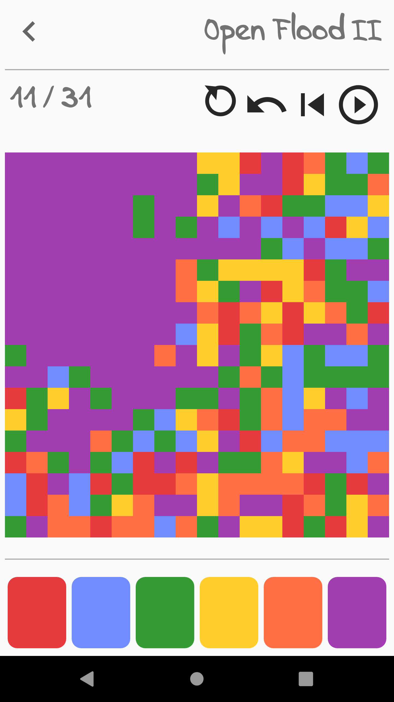

<p align="center">
  
</p>

<h1 align="center">Open Flood2</h1>

## Gameplay

Starting with the upper left hand corner of the board fill adjacent 
cells with that color by tapping the colored buttons. The aim of the game
is to try to fill the entire board with a single color.

You can generate a board from a seed by holding down the new game icon.

## Building / Installing

Build and install using Android Studio or from the command line by executing the
following commands.

To build and install on \*nix:

```
./gradlew installDebug
```

To build on Windows:

```
gradlew.bat installDebug
```

To build without installing, use the `assembleDebug` task instead. This will
output a debug apk in `app/build/outputs/apk/debug`

## License

[GPL 3.0+](https://github.com/GunshipPenguin/open_flood/blob/master/LICENSE.md)
© 

Fonts are Licensed under the [SIL Open Font License](https://github.com/ThePreviousOne/open_flood/blob/master/OFL.txt)

